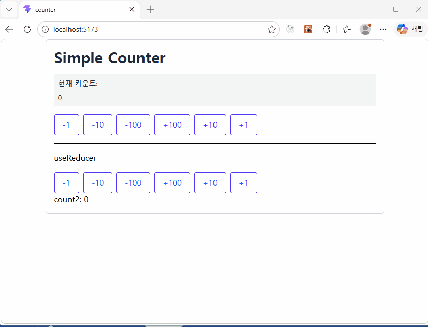
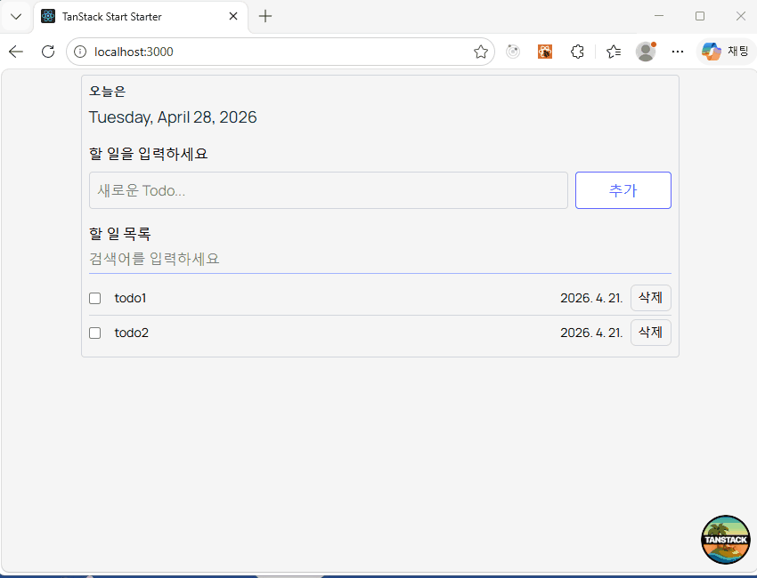
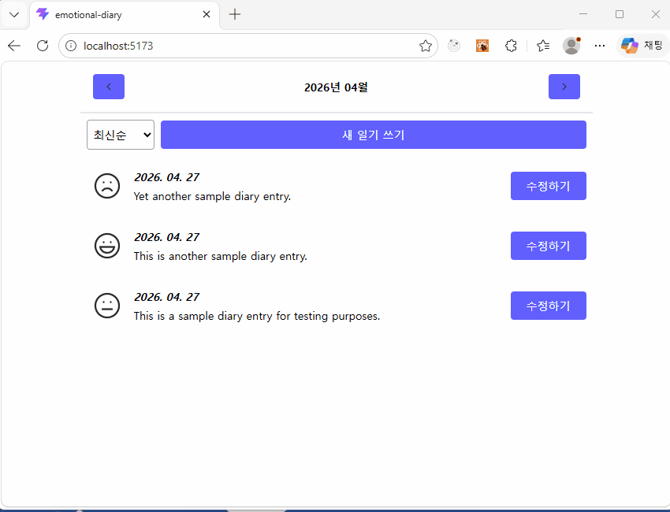

# bite-sized-react-revised-edition

한입 크기로 잘라 먹는 리액트 개정판 실습 프로젝트 모음입니다.

---

## 학습 메모

오랜만에 AI 활용 없이 책의 흐름을 따라가며 직접 코드를 작성해 보고 싶어서 이 저장소에 정리했습니다.

## 설치 및 실행 방법

각 프로젝트는 독립적인 npm 프로젝트입니다. 실행하려는 프로젝트 폴더로 이동한 뒤 의존성을 설치하고 개발 서버를 실행합니다.

### project1: counter

```bash
cd counter
npm install
npm run dev
```

### project2: todo

```bash
cd todo
npm install
npm run dev
```

`todo` 프로젝트는 개발 서버가 기본적으로 `http://localhost:3000`에서 실행되도록 설정되어 있습니다.

### project3: emotional-diary

```bash
cd emotional-diary
npm install
npm run dev
```

---

## 프로젝트별 기술 스택

### project1: counter(P.253)

- 경로: `counter`
```
cd counter
```
- 주제: 카운터 만들기
- 프레임워크/라이브러리: React 19, React DOM
- 언어: TypeScript
- 빌드 도구: Vite 8
- 스타일링: Tailwind CSS 4, `@tailwindcss/vite`
- 컴파일/최적화: React Compiler, Babel, Rolldown Babel Plugin
- 정적 분석: ESLint, TypeScript ESLint, React Hooks ESLint Plugin, React Refresh ESLint Plugin
- 패키지 관리: npm (`package-lock.json`)




### project2: todo(P.295)

- 경로: `todo`
```
cd todo
```
- 주제: 할 일 관리 만들기
- 프레임워크/라이브러리: React 19, React DOM
- 언어: TypeScript
- 애플리케이션/라우팅: TanStack Start, TanStack Router, TanStack Router Devtools, TanStack Devtools
- 서버/런타임: Nitro
- 빌드 도구: Vite 8
- 스타일링: Tailwind CSS 4, Tailwind Typography
- 아이콘: Lucide React
- 컴파일/최적화: React Compiler
- 테스트: Vitest, Testing Library, JSDOM
- 코드 품질: ESLint, TanStack ESLint Config, Prettier
- 패키지 관리: npm (`package-lock.json`)



### project3: emotional-diary(P.415)

- 경로: `emotional-diary/emotional-diary`
```
cd emotional-diary
```
- 주제: 감정 일기장 만들기
- 프레임워크/라이브러리: React 19, React DOM
- 언어: TypeScript
- 라우팅: React Router 7
- 빌드 도구: Vite 8
- 스타일링: Tailwind CSS 4, `@tailwindcss/vite`
- 유틸리티: Day.js, Nano ID, Zod
- 아이콘: Lucide React, 커스텀 SVG 아이콘 컴포넌트
- 컴파일/최적화: React Compiler, Babel, Rolldown Babel Plugin
- 정적 분석: ESLint, TypeScript ESLint, React Hooks ESLint Plugin, React Refresh ESLint Plugin
- 패키지 관리: npm (`package-lock.json`)

